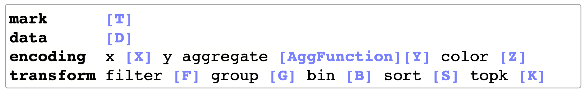
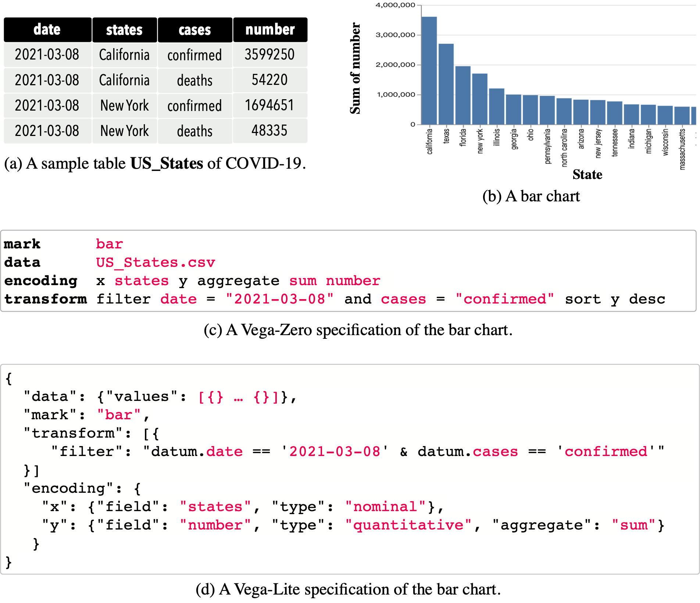
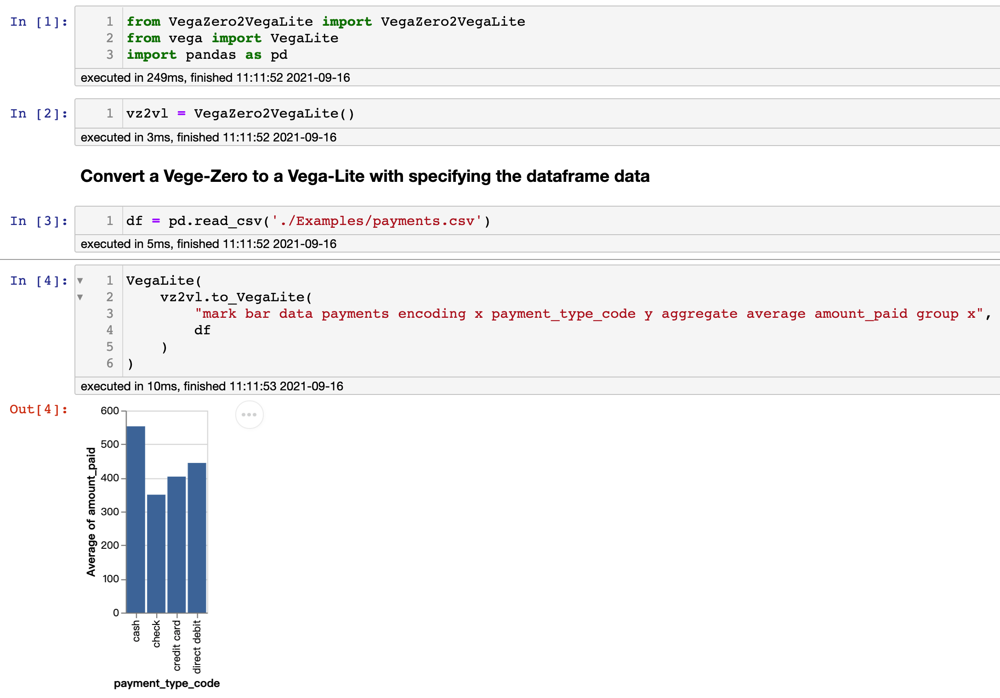

# Vega-Zero

Vega-Zero is a visualization grammar by simplifying Vega-Lite, with the main purpose to flatten a hierarchical Vega-Lite specification to a sequence-based specification. 

Thus, it is much easier to use Vega-Zero to train a sequence-to-sequence model for generating a sequence output. 
Vega-Zero can be used to support some learning tasks, e.g., translating a natural language query to visualization.

Please refer to our [paper](https://github.com/Thanksyy/Vega-Zero/blob/main/ncNet-VIS21.pdf) at IEEE VIS 2021 for more details.

## Definition 

Vega-Zero keeps most of the keywords of the Vega-Lite about the mapping between visual encoding channels and (transformed) data variables. It flattens a JSON object into a sequence of keywords by removing structure-aware symbols such as brackets, colons, and quotation marks. Formally, a unit specification in Vega-Zero is a four tuple (similar to Vega-Lite but with each tuple being a sequence) as:

**unit** = (**mark**, **data**, **encoding**, **transform**)

Naturally, as a simplification of Vega-Lite: 
1. **mark** denotes the chart type, including *bar*, *line*, *point* (for scatter chart), *arc* (for pie chart); 
2. **data** specifies the source data; 
3. **encoding** contains *x*/*y*-axis, *aggregate* function, and *color* based on which column; 
4. **transform** defines some data transformation functions: *filter*, *bin*, *group*, *sort*, and *top-k*.



## Example

Below is an example to show the connection between Vega-Zero and Vega-Lite.




## Convert Vega-Zero to Vega-Lite specification

In this repository, we provide a Python script to convert a Vega-Zero specification to a Vega-Lite specification.
 
Below is an example to run this Python script in the Jupyter Notebook.



## How to use?

Please follow the examples in the ```examples.ipynb```, if you want to render the visualization result in Jupyter Notebook (or Lab), please follow the instruction of [IPython Vega](https://github.com/vega/ipyvega).

## Citing Vega-Zero

```bibTeX
@ARTICLE{ncnet,  
author={Luo, Yuyu and Tang, Nan and Li, Guoliang and Tang, Jiawei and Chai, Chengliang and Qin, Xuedi},  
journal={IEEE Transactions on Visualization and Computer Graphics},   
title={Natural Language to Visualization by Neural Machine Translation},   
year={2021},  
volume={},  
number={},  
pages={1-1},  doi={10.1109/TVCG.2021.3114848}}
```

## License
The software is available under the [MIT License](https://github.com/Thanksyy/Vega-Zero/blob/main/README.md).

## Contact
If you have any questions, feel free contact Yuyu Luo (luoyy18 at mails.tsinghua.edu.cn).
